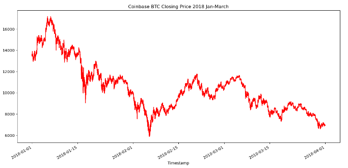

# Crypto Arbitrage Analysis

This script will automate the calculations used to evaluate Bitcoin arbitrage opportinities between the Coinbase and Bitstamp exchanges. The input data is read from two CSV files spanning the first three months of 2018. The purpose is to efficiently discover trends in arbitrage and collect statistical data.

---

## Technologies

The script is written in Python 3.7 using Jupyter Lab, and exists as a Python Notebook file (.ipynb). The two datasheets are in CSV (.csv) format.

The user will need to install and/or import the following:

* [Python3](https://www.python.org/downloads/) - This script is written in Python3, which the user will need installed.
* [Anaconda](https://docs.continuum.io/anaconda/) - A package manager for installing pandas and Jupyter Lab. Optional but efficient.
* [Jupyter Lab - Anaconda](https://anaconda.org/anaconda/jupyter) - Optional notebook workspace, useful for users wanting to experiment with the code.
* [Jupyter Lab- Manual Install](https://jupyterlab.readthedocs.io/en/stable/getting_started/installation.html) - Install link for use w/o Anaconda. For users not utilizing Anaconda.
* [Pandas - Anaconda](https://docs.anaconda.com/navigator/tutorials/pandas/) - Essential for DataFrame/Series manipulation and CSV reading. 
* [Pandas - Manual Install](https://pandas.pydata.org/docs/getting_started/install.html) - Install link for use w/o Anaconda. For users not utilizing Anaconda.
* [Pathlib](https://docs.python.org/3/library/pathlib.html) - For file paths.
* [Matplotlib](https://matplotlib.org/stable/users/installing/index.html) - Used with pandas for visually plotting data.

---

## Installation Guide

The user will need to have [Python3](https://www.python.org/downloads/) downloaded first, then [Anaconda](https://docs.continuum.io/anaconda/).

Anaconda Navigator can be used to easily install and/or access [Jupyter Lab - Anaconda](https://anaconda.org/anaconda/jupyter) and [Pandas - Anaconda](https://docs.anaconda.com/navigator/tutorials/pandas/). They should be accessable immediately after installing Anaconda; if not, follow the previous links. If you are not using Anaconda and prefer manual installs, use the Manual Install links provided in the previous section and follow the steps listed in the documentation.

If using Miniconda instead of Anaconda, the user will need to set up their virtual environment first. Use this command in a terminal window:

```
    conda create -n name_of_my_env python
```
Then, to enter the environment, use this command:
```
    source activate name_of_my_env
```
For Windows users, you will need to use:
```
    activate name_of_my_env
```
Last, we will install pandas:
```
    conda install pandas
```
The user may also need to install pathlib and matplotlib with the following commands:
```
    conda install matplotlib
```
```
    conda install -c anaconda pathlib
```

---

## Usage

The code will need to be adapted for use with alternate datasheets or a different date/time within the same datasheets. New data should work if the CSV files are formatted similarly, but the user will need to edit slicing syntax, update plot labels, change parameters, and perform data cleanup as needed(NaN/missing values, currency symbol removal, etc.,). Data cleanup is included in the code, but only for a targeted section of the provided datasheets, and would need to be updated if processing new data.

The user will also need to determine when to swap variables to keep integers from becoming negative. This is because the function(s) involve subtracting the lower value from the higher value, each representing one of the datasheets. The variables must be consistently swapped if the higher/lower value designation switches. 

Here is an example of a plot that can be generated:



---

## Contributors

This project was completed by Austin Caras while enrolled in the UW FinTech continuing education course. You can contact him at caras.austin@gmail.com for any questions.

---

## License

This project is unlicensed and free to use by anyone.

---